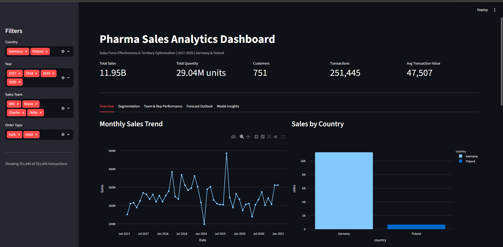
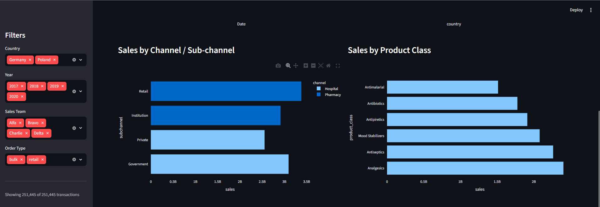
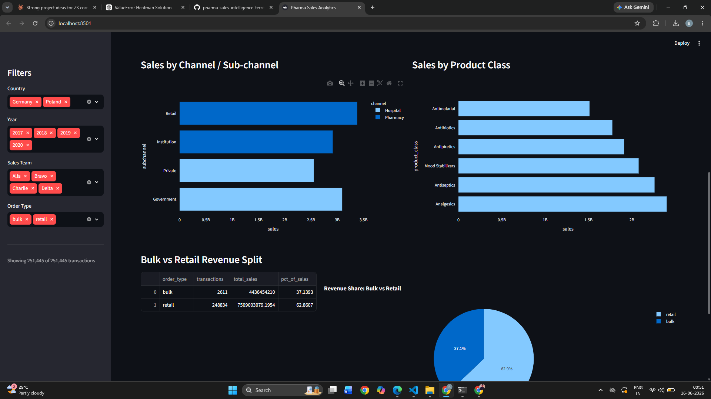

# Pharma Sales Analytics: Sales Force Effectiveness & Territory Optimization
 
End-to-end analytics project on 254,082 pharmaceutical sales transactions
(2017-2020, Germany & Poland) — covering data cleaning, exploratory analysis,
customer segmentation, sales rep/territory performance, demand forecasting,
predictive modeling with SHAP, and an interactive dashboard.
 
## Project Narrative
 
Germany generates ~16x more revenue than Poland despite identical sales-force
resourcing (13 reps, 4 teams in both countries). Customer segmentation reveals
Poland forms its own "Underserved Market" segment with 0% growth, while a
predictive model with SHAP confirms `country` is the single strongest driver
of transaction value — more influential than channel, product mix, or sales
team. This points to a market-level (not execution-level) root cause, with
specific recommendations for resource reallocation, account management, and
forecasting strategy. Full findings: [`reports/findings_and_recommendations.md`](reports/findings_and_recommendations.md).
 
## Dashboard Preview
 



 
## Project Structure
 
```
pharma-sales-analytics/
├── data/
│   ├── raw/                  # original Pharma_data_analysis.xlsx (not in repo)
│   └── processed/            # cleaned_data.csv, customer_segments.csv
├── notebooks/
│   ├── 01_data_cleaning.ipynb
│   ├── 02_eda.ipynb
│   ├── 02b_anomaly_investigation.ipynb
│   ├── 03_segmentation.ipynb
│   ├── 04_rep_performance.ipynb
│   ├── 05_forecasting.ipynb
│   └── 06_predictive_model.ipynb
├── src/
│   ├── data_cleaning.py
│   ├── eda_utils.py
│   ├── segmentation.py
│   ├── rep_performance.py
│   ├── forecasting.py
│   └── model.py
├── dashboard/
│   └── app.py                # Streamlit dashboard
├── reports/
│   ├── figures/               # exported charts
│   └── findings_and_recommendations.md
├── requirements.txt
└── README.md
```
 
## Setup
 
```bash
python -m venv venv
source venv/bin/activate        # Windows: venv\Scripts\activate
pip install -r requirements.txt
```
 
Place `Pharma_data_analysis.xlsx` in `data/raw/`.
 
## Running the Analysis
 
Run notebooks in order (each depends on outputs from the previous):
 
1. `01_data_cleaning.ipynb` — cleans raw data, saves `data/processed/cleaned_data.csv`
2. `02_eda.ipynb` — exploratory analysis, trends, country/channel/product/team breakdowns
3. `02b_anomaly_investigation.ipynb` — investigates sales spikes/dips, identifies bulk vs retail pattern
4. `03_segmentation.ipynb` — K-Means customer segmentation, saves `data/processed/customer_segments.csv`
5. `04_rep_performance.ipynb` — rep/team KPIs, country resource allocation analysis
6. `05_forecasting.ipynb` — Prophet forecasts for retail/bulk x Germany/Poland
7. `06_predictive_model.ipynb` — XGBoost + SHAP analysis of sales value drivers
## Running the Dashboard
 
```bash
streamlit run dashboard/app.py
```
 
Requires `data/processed/cleaned_data.csv` (from notebook 01) and
`data/processed/customer_segments.csv` (from notebook 03) to be present.
 
## Key Findings (Summary)
 
- **Revenue concentration**: 1% of transactions (bulk/institutional orders)
  generate 37.6% of total revenue.
- **Country disparity**: Germany generates ~16x more revenue than Poland with
  identical sales-force resourcing; Poland gets 5.2x fewer transactions per rep.
- **Segmentation**: 4 customer segments — Germany Stable Key Accounts (~47% of
  revenue), Germany Core Growth Retail (43%, 11% growth), Germany Rising Star
  Accounts (4.25%, 515% growth), and Poland Underserved Market (5.7%, 0% growth).
- **Forecasting**: Both core retail markets forecast to decline (-18% Germany,
  -24% Poland) over the next 12 months; bulk segments too lumpy to forecast
  reliably.
- **Predictive model**: `country` is the dominant driver of transaction value
  (SHAP impact ~9,377) — more than double the next factor — confirming the
  performance gap is market-level, not execution-level.
Full details and recommendations: [`reports/findings_and_recommendations.md`](reports/findings_and_recommendations.md)
 
## Tech Stack
 
Python, pandas, scikit-learn, XGBoost, SHAP, Prophet, Streamlit, Plotly,
matplotlib, seaborn
 
